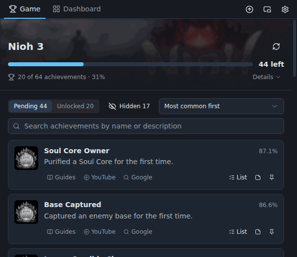
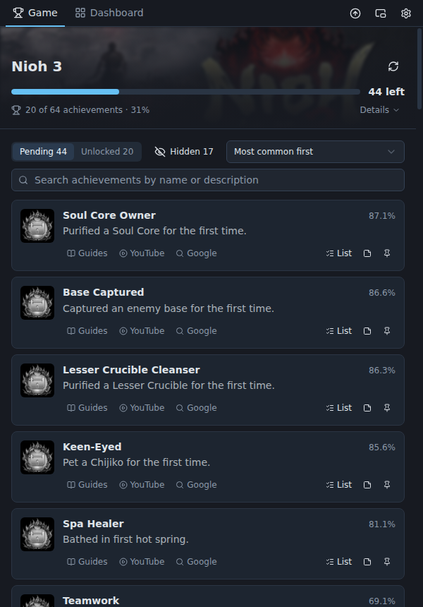
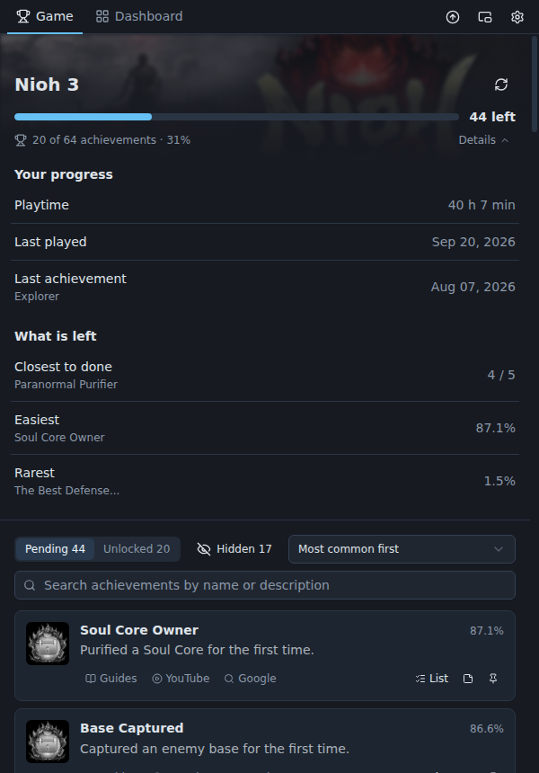
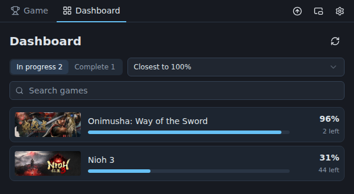
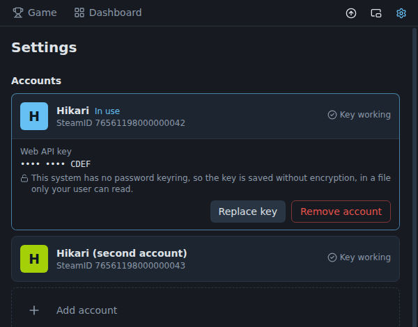

<p align="center">
  
</p>

<h1 align="center">Trophy Tracker</h1>

<p align="center">
  Veja o que falta no jogo da Steam que você está jogando, sem sair do jogo.
</p>

<p align="center">
  <a href="https://github.com/joaosoarees/trophy-tracker/releases/latest"></a>
  <a href="https://github.com/joaosoarees/trophy-tracker/actions/workflows/ci.yml"></a>
  <a href="https://codecov.io/gh/joaosoarees/trophy-tracker"></a>
  
  <a href="https://github.com/joaosoarees/trophy-tracker/releases"></a>
  <a href="LICENSE"></a>
</p>

<p align="center">
  <a href="README.md">English</a> · <strong>Português</strong>
</p>

<p align="center">
  
</p>

A Steam lista as conquistas que faltam sem dizer como consegui-las, esconde as ocultas e espalha o seu progresso em uma página por jogo. O Trophy Tracker é uma janela estreita que fica ao lado do jogo, no segundo monitor, e responde à pergunta que todo caçador de conquistas se faz: **o que falta, e como eu consigo?**

É gratuito, de código aberto e não tem vínculo com a Valve nem com a Steam.

> As imagens desta página mostram o app em inglês. Ele também está em português do Brasil, espanhol e francês.

## O que ele faz

<table>
  <tr>
    <td width="50%" valign="top">
      <h3>Acompanha o jogo que você abre</h3>
      <p>Abra um jogo na Steam e o app troca para ele sozinho. Sem jogo aberto, mostra o último que você jogou. Uma conquista desbloqueada durante o jogo aparece por conta própria, com quantas ainda faltam.</p>
      <h3>Conquistas ocultas, reveladas</h3>
      <p>Nome e descrição das conquistas que a Steam esconde, a raridade de cada uma e os contadores de progresso da própria Steam, nos jogos que têm.</p>
      <h3>Um clique até um guia</h3>
      <p>Cada conquista abre uma busca de como consegui-la, nos guias da comunidade Steam, no YouTube ou no Google.</p>
    </td>
    <td width="50%">
      
    </td>
  </tr>
  <tr>
    <td width="50%">
      
    </td>
    <td width="50%" valign="top">
      <h3>O que a Steam não acompanha, você acompanha</h3>
      <p>A Steam não diz quais colecionáveis faltam. Toda conquista pode ter a sua própria checklist, uma nota e um marcador de fixada, guardados no seu computador entre uma sessão e outra.</p>
      <h3>Todos os jogos, pelo que falta</h3>
      <p>Um painel lista o que você jogou, ordenado por proximidade dos 100%, e um jogo concluído ganha a única comemoração do app.</p>
      <p></p>
    </td>
  </tr>
  <tr>
    <td width="50%" valign="top">
      <h3>Várias contas</h3>
      <p>Adicione mais de uma conta Steam e troque entre elas com um clique; cada uma guarda a própria chave, notas e checklists. No Windows, o app acompanha a conta que estiver conectada na Steam.</p>
      <h3>No seu idioma</h3>
      <p>Inglês, português do Brasil, espanhol e francês. O idioma muda o app inteiro, inclusive os nomes das conquistas enviados pela Steam.</p>
    </td>
    <td width="50%">
      
    </td>
  </tr>
</table>

## Download

Baixe o instalador do seu sistema na [última versão](https://github.com/joaosoarees/trophy-tracker/releases/latest):

| Sistema | Arquivo                                                                                        |
| ------- | ---------------------------------------------------------------------------------------------- |
| Windows | `Trophy-Tracker-<versão>-Windows.exe`                                                          |
| macOS   | `Trophy-Tracker-<versão>-macOS-arm64.dmg` (Apple Silicon) ou `-macOS-x64.dmg` (Intel)          |
| Linux   | `Trophy-Tracker-<versão>-Linux.AppImage` (qualquer distribuição) ou `-Linux-Debian-Ubuntu.deb` |

Na primeira execução o app pede o idioma, o seu SteamID e a sua própria [chave da Web API da Steam](https://steamcommunity.com/dev/apikey), e confere se os detalhes dos jogos do seu perfil estão públicos. No Windows e com o AppImage do Linux ele passa a se atualizar sozinho; no macOS e com o `.deb`, avisa quando há versão nova.

**Os instaladores não são assinados**, e não há data para isso mudar, então o sistema avisa na primeira execução:

- **Windows:** no aviso do SmartScreen, escolha "Mais informações" e depois "Executar assim mesmo". Com o **Smart App Control** ligado (Segurança do Windows → Controle de aplicativos e do navegador), o Windows pode recusar o instalador de vez, sem opção de liberar.
- **macOS:** depois da primeira tentativa de abrir o app, vá em Ajustes do Sistema → Privacidade e Segurança e escolha "Abrir Mesmo Assim".
- **Linux:** `sudo apt install ./Trophy-Tracker-<versão>-Linux-Debian-Ubuntu.deb`, ou torne o AppImage executável (`chmod +x`) e rode.

O que mudou em cada versão está no [registro de mudanças](CHANGELOG.md) (em inglês).

## Privacidade

O Trophy Tracker não tem conta, servidor nem telemetria. Ele só se comunica com:

- **a Steam** (`api.steampowered.com` e os servidores de imagem da Steam), com a chave da Web API e o SteamID que você fornece, para ler seus jogos e conquistas;
- **o GitHub** (`api.github.com` e `github.com`), para procurar uma versão mais nova e, no Windows e no AppImage do Linux, baixá-la.

Suas chaves, notas e checklists ficam guardadas só no seu computador, em `%APPDATA%\trophy-tracker` (Windows), `~/Library/Application Support/trophy-tracker` (macOS) ou `~/.config/trophy-tracker` (Linux). Uma chave salva nunca volta a ser exibida, só os quatro últimos caracteres. Os erros vão para um arquivo de log local e nunca são enviados a lugar nenhum.

## Como é feito

Electron, React e TypeScript, com o cuidado que uma ferramenta pequena raramente recebe:

- **Testado onde decide alguma coisa.** 430 testes cobrem a lógica que lê a Steam, guarda os seus dados e atualiza o app, com 95% das instruções cobertas, e rodam em Windows, macOS e Linux a cada envio.
- **A interface é auditada por um script, não de memória.** O `pnpm audit:ui` conduz o app compilado contra um substituto da Steam, uma vez por idioma: passa pela configuração inicial, por todas as telas e pelos fluxos que nenhuma imagem isolada mostra (um jogo iniciando, uma conquista desbloqueada, a Steam fora do ar), conferindo acessibilidade com o axe, foco de teclado, hover e transbordamento. As imagens desta página vêm do mesmo substituto.
- **Um catálogo de componentes.** O `pnpm storybook` mostra cada peça sozinha, em todos os estados, nos quatro idiomas e nas duas larguras para as quais a janela foi feita.
- **Seus arquivos não se perdem numa queda.** Cada um é gravado inteiro antes de substituir o anterior, e um arquivo que não pode ser lido é guardado à parte, nunca sobrescrito.
- **As versões se constroem sozinhas.** Uma tag de versão faz o GitHub Actions compilar e testar os instaladores nos três sistemas e publicá-los com as notas.
- **Um sistema de design escrito** ([DESIGN.md](DESIGN.md)) e as razões das escolhas que não são óbvias ([docs/DECISIONS.md](docs/DECISIONS.md)), ambos em inglês.

## Desenvolvimento

```bash
corepack enable   # uma vez; fornece a versão do pnpm fixada no package.json
pnpm install
pnpm dev          # o app, com recarga
```

O projeto só instala com pnpm. No WSL ou num Linux mínimo, o Electron também precisa de `sudo apt install libnss3 libnspr4 libasound2t64`.

```bash
pnpm test && pnpm lint && pnpm typecheck
pnpm audit:ui      # a auditoria da interface
pnpm storybook     # o catálogo de componentes
pnpm dist          # instaladores do sistema em que você está, em dist/
pnpm screenshots   # as imagens desta página
```

Como o código é organizado e as regras que ele segue estão em [CLAUDE.md](CLAUDE.md); como funcionam as versões e a auditoria, em [docs/](docs). O código, os comentários e a documentação do repositório são em inglês.

## Política de assinatura de código

Os instaladores são gerados a partir deste repositório pelo GitHub Actions (`.github/workflows/release.yml`), a partir de uma tag de versão que só o mantenedor pode criar.

- **Autor, revisor e aprovador:** [Joao Soares](https://github.com/joaosoarees), a única pessoa com acesso de escrita ao repositório.
- Mudanças de outras pessoas chegam como pull requests e são revisadas antes de entrar.

Os instaladores ainda não são assinados.

## Licença

[MIT](LICENSE)
